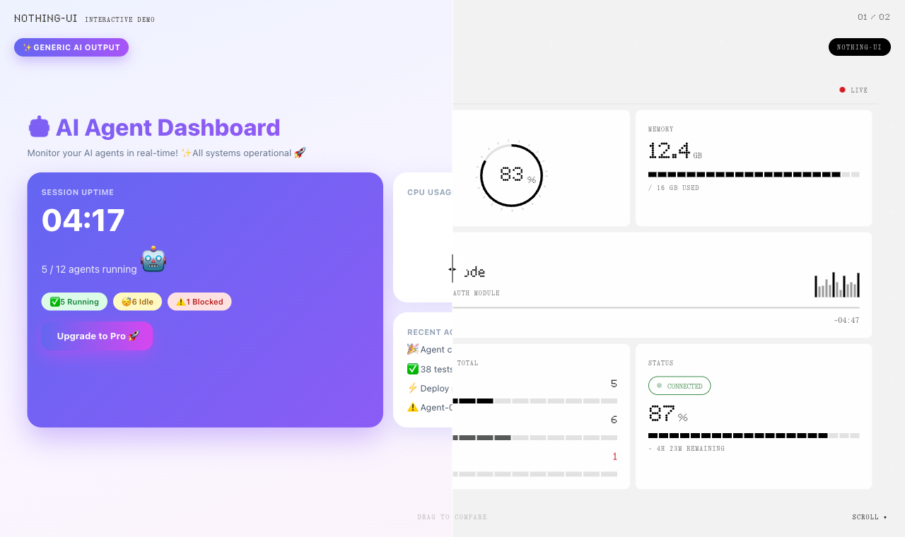
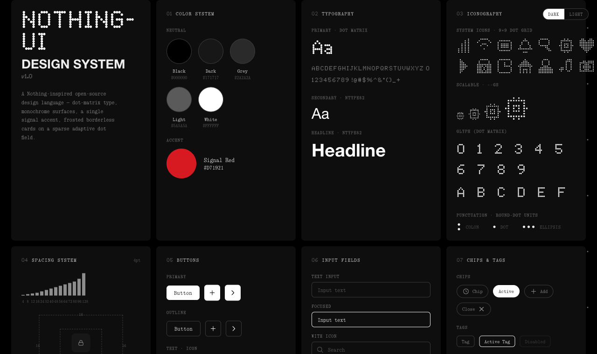
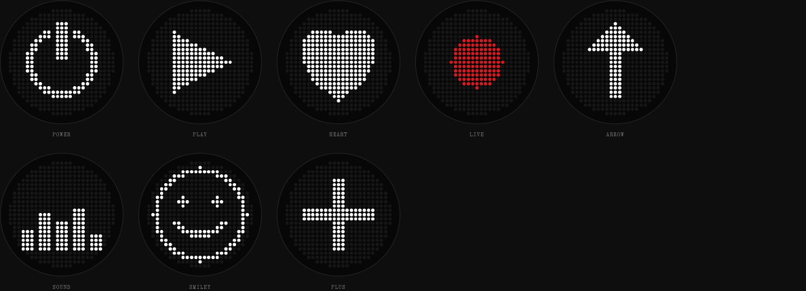

# nothing-ui

[](LICENSE)
[](#quick-start)
[](https://wangbh030722.github.io/nothing-ui-design-system/demo.html)

A zero-dependency, Nothing-inspired UI system for the web. It combines monochrome surfaces, round-dot typography and iconography, a restrained signal-red accent, and sparse adaptive dot fields.

> Pure HTML, CSS custom properties, and a small amount of vanilla JavaScript. No framework, package manager, or build step.



**[Open the interactive comparison](https://wangbh030722.github.io/nothing-ui-design-system/demo.html)** · **[Browse every component](https://wangbh030722.github.io/nothing-ui-design-system/)** · **[Read the generation contract](SPEC.md)**

## Why nothing-ui

- **40+ components** covering foundations, forms, navigation, feedback, data display, and applied dashboards.
- **Dark and light themes** through one `data-theme` attribute.
- **Two dot systems:** scalable 9x9 interface icons and a canonical 25x25 circular Glyph Matrix.
- **AI-ready specification:** `SPEC.md` gives coding agents exact tokens, rules, markup recipes, and a release checklist.
- **Portable by design:** copy the files into any static site or adapt the tokens without introducing a toolchain.
- **Deliberately restrained:** no gradients, decorative shadows, oversized radii, or accent-color overload.

## Quick Start

```html
<link rel="stylesheet" href="css/nothing-ui.css">

<body data-theme="dark">
  <button class="btn btn-primary">Run agent</button>
</body>

<script src="js/nothing-ui.js"></script>
```

Switch themes on any ancestor:

```html
<main data-theme="light">...</main>
```

## Project Structure

```text
.
├── css/
│   ├── tokens.css       Design tokens and font roles
│   └── nothing-ui.css   Components and layout primitives
├── js/
│   └── nothing-ui.js    Theme, controls, and dot-icon rendering
├── fonts/open/          Bundled SIL OFL typefaces and licenses
├── docs/                Repository screenshots
├── index.html           Visual component reference
├── demo.html            Interactive comparison experience
├── SPEC.md              Normative generation contract
└── DESIGN.md            Design rationale and decision history
```

`index.html` is the visual ground truth. Start with `SPEC.md` when asking an AI coding assistant to generate compatible UI; use `DESIGN.md` when you need the reasoning behind the rules.

## Visual Language



- Black, grey, and white carry hierarchy.
- Nothing red `#D71921` is reserved for live, recording, blocked, or needs-input signals.
- Controls use black/white inversion instead of the accent color.
- Cards use material, whitespace, and hairlines rather than shadows.
- Dot-matrix elements share round-dot geometry across type, icons, and status glyphs.

### Glyph Matrix



The 25x25 display uses a circular mask with inactive LED texture, white active cells, and an optional red signal state. Smaller interface icons use a scalable 9x9 grid via `--gs`.

## Fonts

The repository bundles a self-contained, open-source type system: **Doto** for round-dot display type, **Geist** for UI and headlines, **Geist Mono** for labels and data, and **Newsreader Italic** for restrained editorial accents.

All bundled font files are licensed under the SIL Open Font License 1.1. Sources and license copies are listed in [`fonts/README.md`](fonts/README.md). Proprietary Nothing font files remain excluded and must not be committed or redistributed.

## Contributing

Read [`CONTRIBUTING.md`](CONTRIBUTING.md) before opening a pull request. Changes should preserve the token system, work in both themes, and remain build-free.

Security reports should follow [`SECURITY.md`](SECURITY.md). Community participation is governed by the [`CODE_OF_CONDUCT.md`](CODE_OF_CONDUCT.md).

## License and Trademark

The code is available under the [MIT License](LICENSE).

This is an independent community project inspired by Nothing's visual language. It is not affiliated with, endorsed by, or sponsored by Nothing Technology Limited. Nothing, NDot, and NType are trademarks or type assets of their respective owners.
